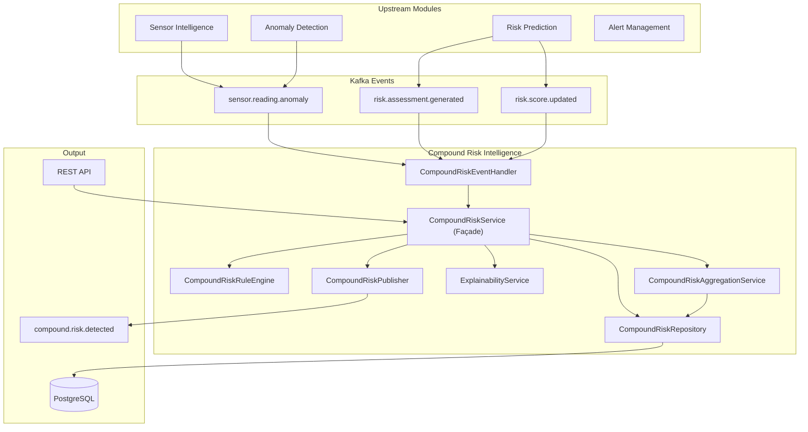
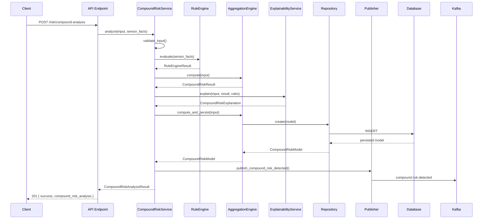
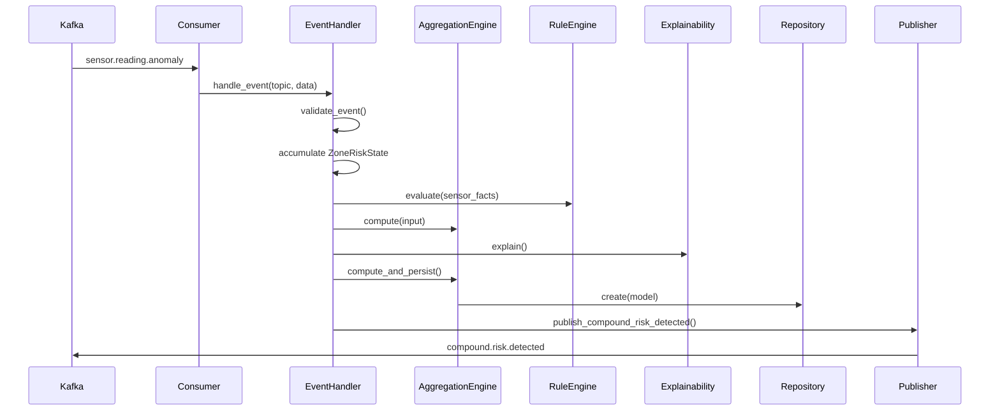

# Compound Risk Intelligence Module — Technical Documentation

> **Version:** 1.0 · **Module:** `app/compound_risk/` · **Status:** Production-Ready
> **Author:** SentinelAI Platform Team · **Last Updated:** 2026-07-08

---

## Table of Contents

1. [Architecture Overview](#1-architecture-overview)
2. [Component Diagram](#2-component-diagram)
3. [Sequence Diagrams](#3-sequence-diagrams)
4. [Domain Layer](#4-domain-layer)
5. [Repository Layer](#5-repository-layer)
6. [Aggregation Engine](#6-aggregation-engine)
7. [Rule Engine](#7-rule-engine)
8. [Explainability Service](#8-explainability-service)
9. [CompoundRiskService Façade](#9-compoundriskservice-façade)
10. [Kafka Integration](#10-kafka-integration)
11. [API Endpoints](#11-api-endpoints)
12. [Configuration](#12-configuration)
13. [Dependency Injection](#13-dependency-injection)
14. [Testing Strategy](#14-testing-strategy)
15. [Deployment & Operations](#15-deployment--operations)

---

## 1. Architecture Overview

The Compound Risk Intelligence module combines signals from **multiple upstream modules** to produce a single, explainable compound risk assessment for each zone/equipment in the industrial facility.

### Design Principles

| Principle | Implementation |
|---|---|
| **Service-Repository Pattern** | Business logic in services, persistence abstracted behind interfaces |
| **Dependency Injection** | All dependencies constructor-injected via FastAPI `Depends()` |
| **PS-1 v2.0 Compliance** | All enums, topics, IDs, timestamps follow the team domain document |
| **Configurable, Not Hardcoded** | Weights, thresholds, and rules are all configurable at init-time |
| **Graceful Degradation** | Kafka/DB failures don't crash the pipeline |
| **Explainability First** | Every risk score includes a human-readable explanation |

### Upstream Inputs

| Source Module | Signal | Scale |
|---|---|---|
| Anomaly Detection (Isolation Forest) | `isolation_forest_score` | 0.0–1.0 |
| Anomaly Detection (Autoencoder) | `autoencoder_score` | 0.0–1.0 |
| Risk Prediction (XGBoost) | `accident_probability` | 0.0–1.0 |
| Risk Prediction | `risk_score` | 0–100 |
| Sensor Intelligence | `sensor_health_score` | 0–100 |
| Alert Management | `active_alert_count`, `alert_severity_max` | count, 0.0–1.0 |
| Threshold Monitoring | `threshold_violation_count` | count |

### Output

| Field | Type | Description |
|---|---|---|
| `compound_risk_score` | float (0–100) | Weighted aggregate score |
| `risk_level` | enum | `LOW \| MEDIUM \| HIGH \| CRITICAL` |
| `confidence_score` | float (0.0–1.0) | Analysis confidence |
| `contributing_factors` | JSON array | Per-component breakdown |
| `recommendation` | string | Human-readable recommended actions |
| `explanation` | structured | Full explainability output |

---

## 2. Component Diagram



### File Structure

```
app/compound_risk/
├── __init__.py
├── api/
│   ├── __init__.py
│   ├── compound_risk_endpoints.py    # FastAPI route handlers
│   └── router.py                     # Router aggregation
├── domain/
│   ├── __init__.py
│   ├── exceptions.py                 # Domain-specific exceptions
│   └── value_objects.py              # RiskLevel, AnomalyType, etc.
├── messaging/
│   ├── __init__.py
│   ├── consumer.py                   # Consumer setup (topic registration)
│   ├── handler.py                    # Event handler (pipeline orchestrator)
│   └── publisher.py                  # Publishes compound.risk.detected
├── models/
│   ├── __init__.py
│   └── compound_risk_model.py        # SQLAlchemy ORM model
├── repositories/
│   ├── __init__.py
│   ├── compound_risk_repository.py   # Abstract interface (port)
│   └── sqlalchemy_compound_risk_repo.py  # SQLAlchemy implementation
├── rules/
│   ├── __init__.py
│   └── rule_engine.py                # Configurable rule engine
├── schemas/
│   ├── __init__.py                   # Pydantic request/response schemas
└── services/
    ├── __init__.py
    ├── compound_risk_facade.py       # CompoundRiskService (main façade)
    ├── compound_risk_service.py      # Aggregation engine
    └── explainability_service.py     # Explanation generator
```

---

## 3. Sequence Diagrams

### 3.1 API Request Flow



### 3.2 Kafka Event Flow



---

## 4. Domain Layer

### 4.1 Value Objects

**File:** `domain/value_objects.py`

```python
class RiskLevel(str, Enum):
    LOW = "LOW"
    MEDIUM = "MEDIUM"
    HIGH = "HIGH"
    CRITICAL = "CRITICAL"
```

All enum values follow PS-1 Common Domain Names v2.0 **exactly**.

### 4.2 Domain Exceptions

**File:** `domain/exceptions.py`

| Exception | Error Code | Usage |
|---|---|---|
| `CompoundRiskError` | `COMPOUND_RISK_ERROR` | Base exception |
| `CompoundRiskAnalysisFailedError` | `COMPOUND_RISK_ANALYSIS_FAILED` | Computation failures |
| `InsufficientScenarioDataError` | `INSUFFICIENT_SCENARIO_DATA` | Empty/default inputs |
| `InvalidRiskComponentError` | `INVALID_RISK_COMPONENT` | Out-of-bounds values |
| `ZoneNotFoundError` | `ZONE_NOT_FOUND` | Unknown zone |
| `CompoundRiskModelNotLoadedError` | `COMPOUND_RISK_MODEL_NOT_LOADED` | Engine unavailable |

All exceptions extend `DomainError` from the shared exception hierarchy.

### 4.3 ORM Model

**File:** `models/compound_risk_model.py` · **Table:** `compound_risk_analyses`

| Column | Type | Description |
|---|---|---|
| `id` | `String(36)` PK | UUID primary key |
| `equipment_id` | `String(100)` | Equipment context (indexed) |
| `zone_id` | `String(100)` | Zone context (indexed) |
| `anomaly_score` | `Float` | Input anomaly score (0–1) |
| `accident_probability` | `Float` | Input accident probability (0–1) |
| `risk_score` | `Float` | Input risk score (0–100) |
| `sensor_health_score` | `Float` | Input sensor health (0–100) |
| `compound_risk_score` | `Float` | Output compound score (0–1) |
| `risk_level` | `String(20)` | `LOW\|MEDIUM\|HIGH\|CRITICAL` (indexed) |
| `confidence_score` | `Float` | Analysis confidence (0–1) |
| `contributing_factors` | `Text` | JSON breakdown |
| `recommendation` | `Text` | Recommended actions |
| `created_at` | `DateTime` | ISO 8601 UTC timestamp |

**Composite indexes:** `(zone_id, created_at)`, `(equipment_id, created_at)`, `(risk_level, created_at)`

### 4.4 Pydantic Schemas

**File:** `schemas/__init__.py`

| Schema | Usage |
|---|---|
| `CompoundRiskRequest` | POST request body |
| `ScenarioInput` | Scenario parameters (nested in request) |
| `CompoundRiskResponse` | Single analysis response |
| `CompoundRiskHistoryResponse` | Paginated history response |
| `ContributingFactor` | Per-component breakdown |
| `DangerousCombination` | Detected dangerous combinations |
| `RecommendedAction` | Prioritised recommended actions |
| `HistoricalContext` | Historical incident context |

---

## 5. Repository Layer

### 5.1 Interface

**File:** `repositories/compound_risk_repository.py`

```python
class CompoundRiskRepository(ABC):
    async def create(analysis: CompoundRiskModel) -> CompoundRiskModel
    async def get_by_id(analysis_id: str) -> Optional[CompoundRiskModel]
    async def get_latest(zone_id?, equipment_id?) -> Optional[CompoundRiskModel]
    async def get_history(zone_id?, equipment_id?, risk_level?, offset, limit) -> list
    async def count(zone_id?, equipment_id?, risk_level?) -> int
    async def delete(analysis_id: str) -> bool
```

### 5.2 SQLAlchemy Implementation

**File:** `repositories/sqlalchemy_compound_risk_repo.py`

- Async SQLAlchemy with `AsyncSession`
- All queries use parameterised filters (no SQL injection)
- History queries ordered by `created_at DESC`
- Count queries share the same filter logic (DRY)

---

## 6. Aggregation Engine

**File:** `services/compound_risk_service.py` · **Class:** `CompoundRiskAggregationService`

### 6.1 Weighted Aggregation

Each upstream signal is normalised to a **0–100 risk scale**, then weighted:

| Component | Default Weight | Normalisation |
|---|---|---|
| Risk Prediction | **0.30** | `accident_probability × 100` |
| Isolation Forest | **0.20** | `score × 100` |
| Autoencoder | **0.15** | `score × 100` |
| Sensor Health | **0.15** | `100 − health_score` (inverted) |
| Active Alerts | **0.10** | `min(count/10, 1) × severity × 100` |
| Threshold Violations | **0.10** | `min(count/5, 1) × 100` |

**Total:** Weights sum to 1.0 (auto-normalised if they don't).

### 6.2 Risk Level Classification

| Score Range | Level |
|---|---|
| 0 – 24.99 | `LOW` |
| 25 – 49.99 | `MEDIUM` |
| 50 – 74.99 | `HIGH` |
| 75 – 100 | `CRITICAL` |

Thresholds are configurable via `RiskLevelThresholds`.

### 6.3 Confidence Calculation

Confidence is derived from three factors:

```
confidence = completeness × 0.4 + agreement × 0.4 + health_factor × 0.2
```

| Factor | Description |
|---|---|
| **Completeness** | How many inputs are non-default (4+ = full) |
| **Agreement** | Inter-model variance (lower = higher confidence) |
| **Health Factor** | `sensor_health_score / 100` |

### 6.4 Key Classes

```python
@dataclass
class CompoundRiskInput:
    isolation_forest_score: float  # 0–1
    autoencoder_score: float       # 0–1
    accident_probability: float    # 0–1
    risk_score: float              # 0–100
    sensor_health_score: float     # 0–100
    active_alert_count: int
    alert_severity_max: float      # 0–1
    threshold_violation_count: int
    equipment_id: Optional[str]
    zone_id: Optional[str]

@dataclass
class CompoundRiskResult:
    compound_risk_score: float     # 0–100
    risk_level: RiskLevel
    confidence_score: float        # 0–1
    contributing_factors: List[Dict]
    component_scores: Dict[str, float]

@dataclass(frozen=True)
class CompoundRiskWeights:
    risk_prediction_weight: float = 0.30
    isolation_forest_weight: float = 0.20
    autoencoder_weight: float = 0.15
    sensor_health_weight: float = 0.15
    alert_weight: float = 0.10
    threshold_violation_weight: float = 0.10
```

---

## 7. Rule Engine

**File:** `rules/rule_engine.py` · **Class:** `CompoundRiskRuleEngine`

### 7.1 Architecture

The rule engine is **fully declarative** — rules are defined as data, not code.

```
Condition → RuleDefinition → RuleResult → RuleEngineResult
```

### 7.2 Condition Model

```python
@dataclass
class Condition:
    field: str              # Fact key (e.g. "temperature_celsius")
    operator: ComparisonOp  # >, >=, <, <=, ==, !=, in, not_in
    threshold: Any          # Comparison value
    negate: bool = False    # NOT operator
```

### 7.3 Supported Operators

| Operator | Symbol | Example |
|---|---|---|
| Greater Than | `>` | `temperature_celsius > 60` |
| Greater Than or Equal | `>=` | `gas_level_ppm >= 100` |
| Less Than | `<` | `equipment_health < 0.5` |
| Equal | `==` | `shift_type == "NIGHT"` |
| In | `in` | `permit_type in ["HOT_WORK"]` |
| **AND** | `AND` | All conditions must match |
| **OR** | `OR` | At least one must match |
| **NOT** | `negate=True` | Inverts a condition |

### 7.4 Default Rules (9 rules)

| # | Rule Name | Conditions | Impact | Severity |
|---|---|---|---|---|
| 1 | `high_temp_and_gas` | temp > 60 AND gas > 100 | 15 | CRITICAL |
| 2 | `pressure_and_equipment_health` | pressure > 5 AND health < 0.5 | 12 | HIGH |
| 3 | `gas_and_maintenance` | gas > 80 AND maintenance active | 10 | HIGH |
| 4 | `gas_and_hot_work` | gas > 50 AND permit = HOT_WORK AND permit active | 18 | CRITICAL |
| 5 | `temp_or_gas_elevated` | temp > 50 OR gas > 80 | 8 | MEDIUM |
| 6 | `vibration_and_equipment_health` | vibration > 5 AND health < 0.5 | 10 | HIGH |
| 7 | `high_worker_density` | worker_count > 10 | 5 | MEDIUM |
| 8 | `night_shift_maintenance` | shift = NIGHT AND maintenance active | 8 | HIGH |
| 9 | `sensor_health_degraded` | sensor_health < 50 | 6 | MEDIUM |

### 7.5 Output

```python
@dataclass
class RuleEngineResult:
    triggered_rules: List[RuleResult]
    total_impact: float         # Sum of all triggered rule impacts
    max_severity: str           # Highest severity among triggered rules
    rules_evaluated: int        # Total rules evaluated
```

---

## 8. Explainability Service

**File:** `services/explainability_service.py` · **Class:** `ExplainabilityService`

### 8.1 Purpose

Generates **human-readable, structured explanations** for every compound risk result. The explanation describes *why* a particular risk level was assigned.

### 8.2 Explanation Components

| Component | Source | Example Output |
|---|---|---|
| Anomaly Score | IF + AE scores | "Anomaly detection identified abnormal behavior (score: 0.85)" |
| Accident Probability | Risk Prediction | "Accident probability exceeded 85% threshold" |
| Sensor Health | Sensor Intelligence | "Sensor health is degraded (40%), reducing data reliability" |
| Active Alerts | Alert Management | "3 active alerts with high severity" |
| Triggered Rules | Rule Engine | "Rule 'high_temp_and_gas' triggered: temp > 60°C AND gas > 100ppm" |

### 8.3 Output Structure

```python
@dataclass
class CompoundRiskExplanation:
    summary: str                           # "Risk level is HIGH because..."
    risk_level: RiskLevel
    factor_explanations: List[FactorExplanation]  # 5 factor breakdowns
    triggered_rules: List[RuleResult]
    key_drivers: List[str]                 # Top contributing factors
    recommendations: List[str]             # Actionable recommendations
```

### 8.4 Example Output

```
"Risk level is HIGH because gas concentration exceeded threshold (115 ppm),
anomaly detection identified abnormal behavior (isolation forest: 0.70,
autoencoder: 0.60), and accident probability is elevated at 65%.
Sensor health is degraded at 60%."
```

---

## 9. CompoundRiskService Façade

**File:** `services/compound_risk_facade.py` · **Class:** `CompoundRiskService`

### 9.1 Responsibilities

The façade is the **single entry-point** for all compound risk operations:

```python
class CompoundRiskService:
    # Full pipeline
    async def analyze(inp, sensor_facts?, correlation_id?) -> CompoundRiskAnalysisResult

    # Dry-run (no persist/publish)
    def compute(inp, sensor_facts?) -> Dict

    # Query delegation
    async def get_by_id(analysis_id) -> Optional[CompoundRiskModel]
    async def get_latest(zone_id?, equipment_id?) -> Optional[CompoundRiskModel]
    async def get_history(zone_id?, ..., offset, limit) -> List[CompoundRiskModel]
    async def count(zone_id?, ...) -> int
```

### 9.2 `analyze()` Pipeline

```
Step 1: Validate inputs (reject all-default)
Step 2: Rule Engine → evaluate sensor facts
Step 3: Aggregation Engine → weighted score computation
Step 4: Explainability → human-readable explanation
Step 5: Persist → CompoundRiskModel to database
Step 6: Publish → compound.risk.detected to Kafka
Step 7: Return CompoundRiskAnalysisResult
```

### 9.3 Error Handling

| Error Type | Behavior |
|---|---|
| `InsufficientScenarioDataError` | Raised, counted in `failed_analyses` |
| `CompoundRiskAnalysisFailedError` | Raised for unexpected failures |
| Kafka publish failure | **Caught and logged** — does not crash |
| No publisher configured | Silently skipped |

### 9.4 Metrics

```python
service.total_analyses    # Count of successful analyses
service.failed_analyses   # Count of failed analyses
service.rule_count        # Number of configured rules
```

---

## 10. Kafka Integration

### 10.1 Consumed Topics

| Topic | Source | Data Used |
|---|---|---|
| `sensor.reading.anomaly` | Sensor Intelligence | IF/AE scores, sensor facts |
| `risk.assessment.generated` | Risk Prediction | accident_probability, risk_score |
| `risk.score.updated` | Risk Prediction | Updated risk scores |

### 10.2 Published Topic

| Topic | Trigger | Key |
|---|---|---|
| `compound.risk.detected` | Every analysis | `zone_id` |

### 10.3 Message Format (PS-1 v2.0 §5.3)

```json
{
  "event_type": "compound.risk.detected",
  "event_id": "uuid-v4",
  "timestamp": "2026-07-08T12:00:00.000Z",
  "source_system": "compound_risk_intelligence",
  "data": {
    "analysis_id": "uuid",
    "zone_id": "ZONE_A",
    "compound_risk_score": 72.5,
    "risk_level": "HIGH",
    "confidence_score": 0.85,
    "contributing_factors": [...],
    "recommendation": "..."
  },
  "version": "1.0"
}
```

### 10.4 Components

| Component | File | Purpose |
|---|---|---|
| `CompoundRiskPublisher` | `messaging/publisher.py` | Publishes events via shared producer |
| `CompoundRiskEventHandler` | `messaging/handler.py` | Processes incoming events, runs pipeline |
| `CompoundRiskConsumerSetup` | `messaging/consumer.py` | Registers handlers on shared consumer |

### 10.5 Event Handler State

The `CompoundRiskEventHandler` maintains a per-zone `ZoneRiskState` that **accumulates** signals across multiple events before triggering analysis:

```python
@dataclass
class ZoneRiskState:
    zone_id: str
    isolation_forest_score: float  # Max retained
    autoencoder_score: float       # Max retained
    accident_probability: float
    risk_score: float
    sensor_health_score: float
    sensor_facts: Dict[str, Any]   # For rule engine
    event_count: int
```

### 10.6 Shared Infrastructure Reuse

The module reuses **all** shared Kafka infrastructure — no new producers, consumers, schemas, or topics are created:

```
app/shared/messaging/
├── topics.py          ← KafkaTopics (30 constants)
├── events.py          ← BaseEvent Pydantic schema
├── serialization.py   ← JSON encode/decode
├── producer.py        ← KafkaEventProducer + NoopEventProducer
└── consumer.py        ← KafkaEventConsumer + NoopEventConsumer
```

---

## 11. API Endpoints

**Base URL:** `/api/v1/risk`

### 11.1 POST `/risk/compound-analysis`

**Calculate compound risk from a scenario.**

**Request:**
```json
{
  "zone_id": "ZONE_A",
  "equipment_id": "EQ001",
  "scenario": {
    "gas_level_ppm": 120,
    "temperature_celsius": 45,
    "pressure_bar": 2.5,
    "maintenance_active": true,
    "worker_count": 12,
    "permit_type": "HOT_WORK",
    "permit_active": true,
    "shift_type": "NIGHT",
    "equipment_health": 0.75,
    "anomaly_score": 0.7,
    "accident_probability": 0.65,
    "risk_score": 62.0,
    "sensor_health_score": 70.0
  }
}
```

**Response (201):**
```json
{
  "success": true,
  "compound_risk_analysis": {
    "id": "uuid",
    "zone_id": "ZONE_A",
    "equipment_id": "EQ001",
    "compound_risk_score": 0.72,
    "risk_level": "HIGH",
    "confidence_score": 0.85,
    "anomaly_score": 0.7,
    "accident_probability": 0.65,
    "risk_score": 62.0,
    "sensor_health_score": 70.0,
    "contributing_factors": [...],
    "recommendation": "...",
    "created_at": "2026-07-08T12:00:00Z"
  }
}
```

**Error Responses:** `422` (validation), `500` (analysis failure)

### 11.2 GET `/risk/compound-analysis/latest`

**Get the most recent compound risk analysis.**

| Parameter | Type | Required | Description |
|---|---|---|---|
| `zone_id` | string | No | Filter by zone |
| `equipment_id` | string | No | Filter by equipment |

**Response:** `200` (same as POST) or `404` if not found.

### 11.3 GET `/risk/compound-analysis/history`

**Get paginated analysis history.**

| Parameter | Type | Required | Default | Description |
|---|---|---|---|---|
| `zone_id` | string | No | — | Filter by zone |
| `equipment_id` | string | No | — | Filter by equipment |
| `risk_level` | string | No | — | Filter by level |
| `offset` | int | No | 0 | Pagination offset |
| `limit` | int | No | 50 | Page size (1–200) |

**Response (200):**
```json
{
  "success": true,
  "predictions": [...],
  "total": 42,
  "offset": 0,
  "limit": 50
}
```

---

## 12. Configuration

### 12.1 Aggregation Weights

```python
CompoundRiskWeights(
    risk_prediction_weight=0.30,
    isolation_forest_weight=0.20,
    autoencoder_weight=0.15,
    sensor_health_weight=0.15,
    alert_weight=0.10,
    threshold_violation_weight=0.10,
)
```

Weights are auto-normalised if they don't sum to 1.0.

### 12.2 Risk Level Thresholds

```python
RiskLevelThresholds(
    low_max=25.0,
    medium_max=50.0,
    high_max=75.0,
)
```

### 12.3 Explainability Thresholds

```python
ExplainabilityThresholds(
    anomaly_notable=0.3,
    anomaly_high=0.7,
    accident_prob_notable=0.3,
    accident_prob_high=0.7,
    sensor_health_degraded=70.0,
    sensor_health_poor=40.0,
    alert_count_notable=1,
    alert_count_high=3,
)
```

### 12.4 Rule Definitions

Rules are defined as `RuleDefinition` dataclasses and passed to `CompoundRiskRuleEngine` at init-time. The 9 default rules are created via `create_default_rules()`. Custom rules can be added without code changes.

---

## 13. Dependency Injection

**File:** `app/core/dependencies.py`

```python
def get_compound_risk_service(
    session: AsyncSession = Depends(get_async_session),
) -> CompoundRiskService:
    repo = SQLAlchemyCompoundRiskRepository(session)
    aggregation = CompoundRiskAggregationService(repo)
    rule_engine = CompoundRiskRuleEngine(create_default_rules())
    explainability = ExplainabilityService()
    publisher = CompoundRiskPublisher(NoopEventProducer())
    return CompoundRiskService(aggregation, rule_engine, explainability, publisher)
```

### DI Graph

```
get_compound_risk_service()
├── AsyncSession (from get_async_session)
├── SQLAlchemyCompoundRiskRepository(session)
├── CompoundRiskAggregationService(repo)
├── CompoundRiskRuleEngine(create_default_rules())
├── ExplainabilityService()
└── CompoundRiskPublisher(NoopEventProducer())
    └── CompoundRiskService(agg, rules, explain, publisher)
```

---

## 14. Testing Strategy

### 14.1 Test Pyramid

```
                    ┌──────────┐
                    │   E2E    │  56 tests
                    │ (API +   │  Full pipeline verification
                    │  Kafka)  │
                ┌───┴──────────┴───┐
                │  Integration     │  70 tests
                │  (Kafka, API)    │  Component integration
            ┌───┴──────────────────┴───┐
            │      Unit Tests          │  350 tests
            │  (Services, Rules, Repo) │  Isolated component testing
            └──────────────────────────┘
```

### 14.2 Test Counts

| Category | File | Tests |
|---|---|---|
| **Unit** | `test_compound_risk_models.py` | 45 |
| **Unit** | `test_compound_risk_repository.py` | 38 |
| **Unit** | `test_compound_risk_aggregation_service.py` | 49 |
| **Unit** | `test_compound_risk_rule_engine.py` | 62 |
| **Unit** | `test_explainability_service.py` | 48 |
| **Unit** | `test_compound_risk_facade.py` | 51 |
| **Unit** | `test_kafka_messaging.py` | 57 |
| **Integration** | `test_compound_risk_kafka.py` | 35 |
| **Integration** | `test_compound_risk_api.py` | 35 |
| **E2E** | `test_compound_risk_e2e.py` | 56 |
| | **Total** | **476** |

### 14.3 Coverage

| Scope | Coverage |
|---|---|
| **Compound Risk module** | **93%+** |
| **Shared messaging** | **83%** |
| **Combined** | **90.23%** |
| **Business logic** (services, rules, explainability) | **96–100%** |

### 14.4 E2E Scenarios

| # | Scenario | Verified |
|---|---|---|
| 1 | Normal operating conditions (LOW) | ✅ |
| 2 | High-risk conditions (HIGH) | ✅ |
| 3 | Critical risk conditions (CRITICAL) | ✅ |
| 4 | Multiple simultaneous anomalies | ✅ |
| 5 | Missing / partial data | ✅ |
| 6 | Invalid data (422) | ✅ |
| 7 | Repository failures | ✅ |
| 8 | Kafka publish failures | ✅ |
| 9 | Rule engine edge cases | ✅ |
| 10 | Multi-zone concurrent analysis | ✅ |
| 11 | Historical query round-trips | ✅ |
| 12 | Full API round-trips | ✅ |
| 13 | Full pipeline (event→DB→API) | ✅ |

### 14.5 Running Tests

```bash
# All compound risk tests
pytest tests/ -k "compound_risk" -v

# With coverage
pytest tests/ --cov=app/compound_risk --cov-report=term-missing

# Full suite
pytest tests/ --override-ini="asyncio_mode=auto" -q
```

---

## 15. Deployment & Operations

### 15.1 Database Migrations

The `compound_risk_analyses` table is created via Alembic migrations. Key indexes:

```sql
CREATE INDEX ix_compound_risk_zone_ts ON compound_risk_analyses(zone_id, created_at);
CREATE INDEX ix_compound_risk_equip_ts ON compound_risk_analyses(equipment_id, created_at);
CREATE INDEX ix_compound_risk_level_ts ON compound_risk_analyses(risk_level, created_at);
```

### 15.2 Kafka Topics

Ensure the following Kafka topics exist before deployment:

```
sensor.reading.anomaly       (consumed)
risk.assessment.generated    (consumed)
risk.score.updated           (consumed)
compound.risk.detected       (produced)
```

### 15.3 Environment Variables

| Variable | Default | Description |
|---|---|---|
| `DATABASE_URL` | sqlite+aiosqlite | Database connection string |
| `KAFKA_BOOTSTRAP_SERVERS` | localhost:9092 | Kafka broker addresses |
| `EVENT_BROKER` | noop | `noop` or `kafka` |
| `APP_ENV` | development | Environment name |

### 15.4 Health Monitoring

The module tracks metrics accessible via the service:

```python
service.total_analyses    # Successful analyses count
service.failed_analyses   # Failed analyses count
service.rule_count        # Active rules count
```

Event handler metrics:

```python
handler.events_processed  # Events successfully processed
handler.events_failed     # Events that failed processing
handler.analyses_produced # Compound risk analyses generated
```

---

> **Document Version:** 1.0 · **Module Status:** Production-Ready · **Test Coverage:** 90.23% · **Total Tests:** 476
